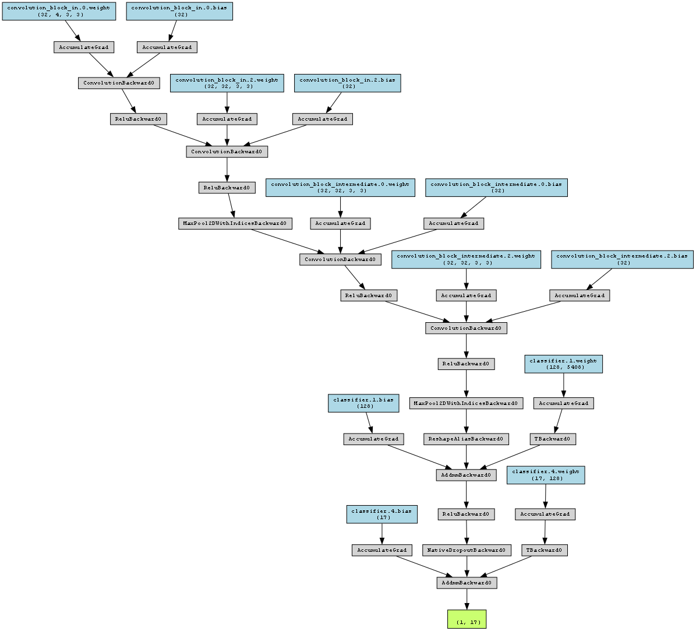
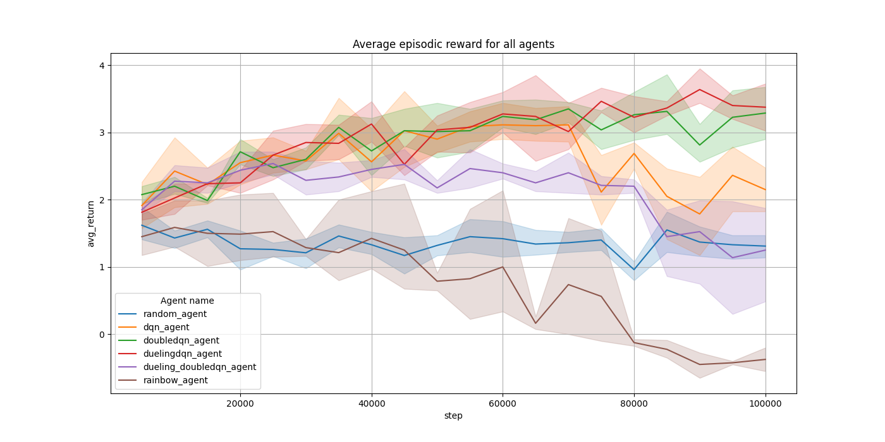
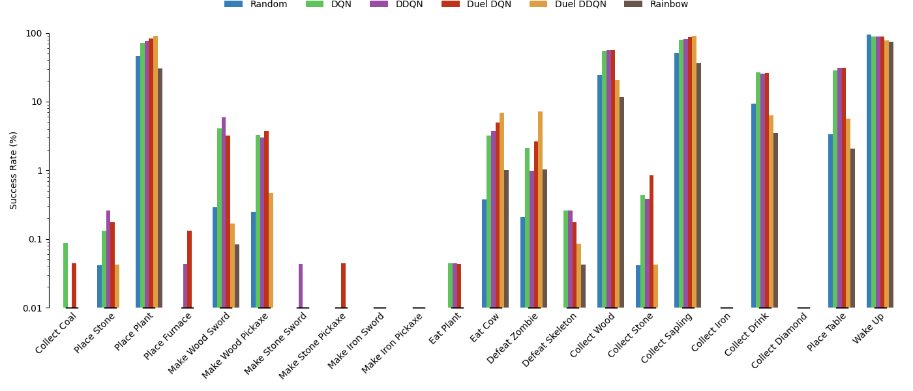

# Crafter - Reinforcement Learning 
This repository contains results and code for training a few deep neural networks for reinforcement learning for the 
Crafter game made by Danijar Hafner, more info on [Crafter Repository](https://github.com/danijar/crafter). If you
wish to experiment yourself you can modify the [hyperparameters.json](hyperparameters.json). More info for training, 
visualisation and the environment can be found on [the initial assignment readme file](assignment_initial.md) 

## Setup
It is required to have **Python v3.10+** and install the libraries from [requirements.txt](requirements.txt).

## Approach
The task is to train a **deep reinforcement learning** algorithm that performs better than a **random agent** which 
takes random decisions at each move. The random agent performs at **worst 0.7** and at **best 1.8** average reward per 
episode. When playing the game we've seen that is difficult even for a human to beat this game, the difficulties were
surviving during the night and eating to avoid starvation (gardening was necessary for this since cows were limited). 

We chose to start small with a DQN (Deep Q Network) and optimize the hyperparameters until the agent performed better
than the random agent. Since each input to the model are 4 gray scaled images, a CNN architecture was chosen for the
backbone of the DQN agent, the CNN architecture is similar with TinyVGG, then at the classifier layer we used two
fully connected layers. 

After having a strong baseline agent, we trained better versions of that agent with the same hyperparameters and 
backbone neural network architectures such as:
* DDQN (Double DQN)
* Dueling DQN
* Dueling DDQN 
* Rainbow C51DQN

## Results
To visualize some results we chose to plot the average episodic reward for three seeds.

The score on Crafter for each trained agent over three seeds.

The agent ability spectrum for each trained agents over all the success rates of each achievement.

Achievement counts for Dueling DQN agent, our best performing one.

## Hacking the environment with heuristics
Since in a real-world scenario heuristics such as, avoid doing the same task over and over or find the resources 
needed to avoid dying would be likely used, for the future we would like to implement some heuristics:
* Check if a unique achievement was made before taking an action (avoid crafting a wood pickaxe if we already have one)
* Check if there is enough resources to craft
* If the player is starving search for a cow or plant
* Remember where he created some buildings
* If he needs more water, repeat the action of drinking water.

